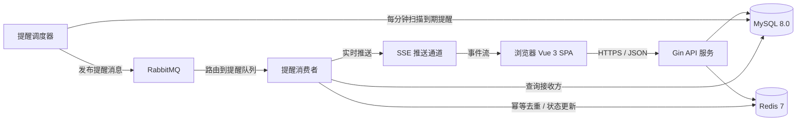
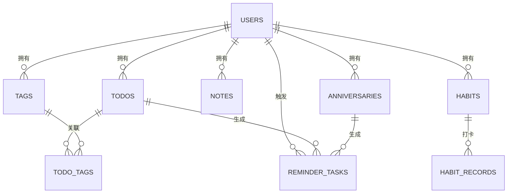
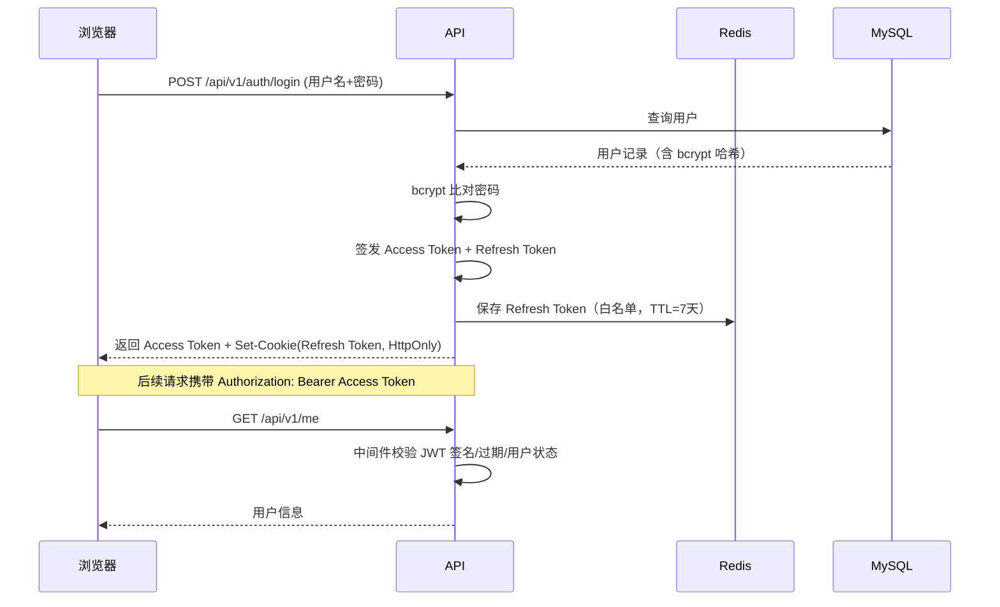
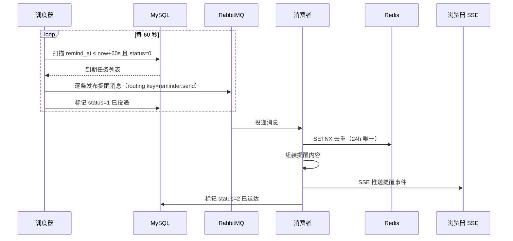

# VIBE 生活待办与记事本 · 技术设计文档

> 版本：v1.0  
> 日期：2026-08-19  
> 状态：待评审  
> 依据：需求文档 v1.0（含 2026-08-19 技术决策补充）  
> 读者对象：开发工程师、测试工程师、项目负责人

---

## 1. 概述

### 1.1 项目背景

VIBE 是一个面向日常生活的 Web 应用，提供待办事项、记事本、习惯打卡、纪念日倒计时四大核心模块，并配备完整的账号体系与提醒能力。系统采用前后端分离架构：前端为 Vue 3 单页应用（SPA），后端为 Go + Gin 提供的 RESTful API，数据层使用 MySQL，Redis 承担缓存与安全类存储，RabbitMQ 承担异步提醒任务的可靠投递。

### 1.2 设计目标与原则

1. **安全**：认证采用 JWT + Refresh Token 双机制；用户密码加盐哈希存储；数据库连接密码加密存储；全链路输入校验与限流。
2. **可靠**：提醒任务通过消息队列异步投递，消费侧幂等、可重试、可补偿，避免丢失提醒。
3. **可维护**：后端严格分层（路由 / 业务 / 数据访问），统一响应格式、错误码与日志规范；前端按模块拆分状态管理与组件。
4. **可扩展**：各模块独立演进；消息队列、缓存与数据库均可平滑升级；为多端同步、统计报表预留扩展点。
5. **本地优先**：数据落在本地 MySQL，无需外部云服务，适合个人及小规模家庭使用。

### 1.3 需求范围摘要

- 功能范围：核心待办（FR-01~03）、基础功能（FR-04~09）、日常生活功能（FR-10~14）、账号与安全（FR-15~19，FR-20 待定）。
- 本期不实现：统计报表、数据导入导出、多重提醒、多端同步、主题切换（backlog，FR-B1~B5）。

---

## 2. 总体架构

### 2.1 架构图



### 2.2 分层说明

| 层 | 职责 | 说明 |
|----|------|------|
| 表现层 | 页面渲染、交互、表单校验 | Vue 3 SPA，路由级代码分割 |
| 接入层 | HTTP 路由、中间件、参数绑定 | Gin；统一鉴权、限流、日志、恢复 |
| 业务层 | 业务规则、事务编排、领域校验 | 按模块拆分的 Service |
| 数据访问层 | ORM 映射、SQL 封装 | GORM + MySQL；缓存访问封装 |
| 消息层 | 异步提醒的投递、消费、重试 | RabbitMQ + 独立消费者进程 |
| 调度层 | 定时扫描到期提醒，生成任务 | 提醒调度器（独立进程或内嵌协程） |

### 2.3 技术栈总览

| 端 | 技术 | 版本建议 | 用途 |
|----|------|----------|------|
| 前端 | Vue | 3.x（Composition API + `<script setup>`） | 框架 |
| 前端 | TypeScript | 5.x | 类型安全 |
| 前端 | Vite | 5.x | 构建与开发服务器 |
| 前端 | Pinia | 2.x | 状态管理 |
| 前端 | Vue Router | 4.x | 路由与导航守卫 |
| 前端 | Axios | 1.x | HTTP 客户端（拦截器封装） |
| 前端 | Element Plus | 2.x | UI 组件库 |
| 前端 | Day.js | 1.x | 日期时间处理与倒计时计算 |
| 后端 | Go | 1.22+ | 语言 |
| 后端 | Gin | 1.9.x | HTTP 框架 |
| 后端 | GORM | 1.25.x | ORM / 迁移 |
| 后端 | golang-jwt | v5 | JWT 签发与校验 |
| 后端 | go-redis | v9 | Redis 客户端 |
| 后端 | amqp091-go | 1.x | RabbitMQ 客户端 |
| 后端 | golang.org/x/crypto/bcrypt | 最新 | 用户密码哈希 |
| 后端 | Viper | 1.x | 配置加载 |
| 后端 | Zap | 1.x | 结构化日志 |
| 后端 | Swaggo | 最新 | OpenAPI 文档生成 |
| 存储 | MySQL | 8.0+ | 业务数据 |
| 缓存 | Redis | 7.x | Token、限流、去重、缓存 |
| 消息 | RabbitMQ | 3.12+ | 提醒任务异步投递 |

### 2.4 关键选型理由

- **Gin + Go**：高并发下性能好、部署为单二进制、标准库生态成熟，适合 API 服务与常驻消费者进程。
- **GORM**：结构化建表与迁移，降低重复 SQL 编写；复杂报表查询仍可回退原生 SQL。
- **Redis**：Refresh Token 白名单/黑名单、登录失败计数、提醒幂等去重、接口限流，均为典型缓存场景。
- **RabbitMQ**：提醒属于"可延迟、可重试、需持久化"的异步任务，消息队列比纯定时器更可靠；消费失败可重新入队。
- **SSE 实时推送**：提醒是服务端向浏览器单向推送，SSE 相比 WebSocket 实现更简单、自动重连、兼容性足够。

---

## 3. 后端设计

### 3.1 分层架构

```
请求 → Router → Middleware → Handler（参数绑定/响应封装）
                              ↓
                          Service（业务规则/事务）
                              ↓
                         Repository（数据访问）
                              ↓
                    MySQL / Redis / RabbitMQ
```

规则：
- Handler 只做参数解析、调用 Service、封装响应，不写业务逻辑。
- Service 承载业务规则与事务边界，是唯一允许跨 Repository 编排的层。
- Repository 只做数据读写，返回领域模型或 DTO。
- 依赖方向自上而下，禁止反向引用；模块间通过 Service 接口协作。

### 3.2 后端目录结构

```
server/
├── cmd/
│   ├── api/main.go            # API 服务入口
│   ├── scheduler/main.go      # 提醒调度器入口
│   └── worker/main.go         # 提醒消费者入口
├── internal/
│   ├── config/                # 配置加载与解密
│   ├── model/                 # GORM 模型
│   ├── dto/                   # 请求/响应结构体
│   ├── repository/            # 数据访问层
│   ├── service/               # 业务层
│   ├── handler/               # HTTP 处理器
│   ├── middleware/            # 鉴权/限流/日志/恢复/CORS
│   ├── router/                # 路由注册
│   ├── mq/                    # RabbitMQ 生产者/消费者封装
│   ├── redisx/                # Redis 客户端封装
│   ├── auth/                  # JWT 签发校验、密码加密解密
│   ├── notify/                # SSE 连接管理与推送
│   └── pkg/                   # 通用工具（错误码、分页、时间）
├── config/
│   ├── config.yaml            # 运行配置（DB 密码为密文）
│   └── config.example.yaml    # 配置模板
├── docs/                      # Swagger 生成文档
├── tests/                     # 集成测试
├── go.mod
└── Makefile
```

三个进程（api / scheduler / worker）共享 `internal` 代码，通过同一配置与依赖注入启动，避免逻辑重复。

### 3.3 配置管理

- 配置文件 `config.yaml` 保存非敏感项与密文项；密钥类敏感项（AES 密钥）通过环境变量注入。
- 启动时加载顺序：默认值 → 环境变量 → 配置文件；显式错误（如密钥缺失、密文无法解密）必须启动失败，禁止降级放行。
- 数据库密码在配置中仅存密文 `db_password_cipher`，运行时解密后建立连接，解密结果只存在于内存，不写入日志。

### 3.4 中间件设计

| 中间件 | 职责 | 关键行为 |
|--------|------|----------|
| Recovery | 捕获 panic | 记录堆栈，返回 500 统一响应，避免进程崩溃 |
| RequestLogger | 请求日志 | 记录请求 ID、方法、路径、状态码、耗时、用户 ID |
| RequestID | 链路标识 | 生成/透传 `X-Request-ID`，贯穿日志与消息 |
| CORS | 跨域控制 | 仅允许配置的域名白名单；预检请求正确处理 |
| JWTAuth | 鉴权 | 校验 `Authorization: Bearer`，解析用户 ID 注入上下文 |
| RateLimit | 限流 | 登录接口按 IP + 账号双维度；业务接口按用户维度 |
| Validation | 参数校验 | 统一校验 query/body，返回 400 与明确错误信息 |

### 3.5 统一响应与错误码

响应包裹：

```json
{
  "code": 0,
  "message": "ok",
  "data": { }
}
```

错误码分段约定：

| 段 | 含义 |
|----|------|
| 0 | 成功 |
| 1000~1999 | 通用错误（参数错误、未授权、无权限、资源不存在、冲突、限流） |
| 2000~2999 | 账号与认证错误 |
| 3000~3999 | 待办模块错误 |
| 4000~4999 | 记事模块错误 |
| 5000~5999 | 打卡模块错误 |
| 6000~6999 | 纪念日模块错误 |
| 7000~7999 | 提醒/消息模块错误 |
| 9000~9999 | 系统内部错误 |

关键通用错误码：`1001` 参数错误、`1002` 未登录/Token 失效、`1003` 无权限、`1004` 资源不存在、`1005` 资源冲突、`1006` 请求过于频繁。

### 3.6 日志设计

- 使用 Zap，生产环境 JSON 输出，开发环境控制台输出。
- 统一字段：`request_id`、`user_id`、`module`、`action`、`latency_ms`、`error`。
- 禁止记录：密码、明文 Token、解密后的数据库密码、用户完整会话内容。
- 安全事件（登录成功/失败、Token 刷新、登出、暴力破解触发）单独以 `security` 模块输出。

### 3.7 事务与数据一致性

- 多表写入（如创建待办 + 生成提醒任务）必须位于同一数据库事务内，确保业务数据与提醒任务同时成功或同时回滚。
- 跨进程一致性（消息发布与数据库提交）采用"先提交事务，再发布消息"策略，配合消费侧幂等处理；极端情况下消息丢失由调度器补偿扫描兜底。

---

## 4. 数据库设计（MySQL）

### 4.1 设计规范

- 存储引擎：InnoDB；字符集：`utf8mb4`，排序规则 `utf8mb4_unicode_ci`。
- 主键：自增 BIGINT；所有业务表包含 `created_at`、`updated_at`。
- 删除策略：业务数据软删除（`deleted_at` 可空索引），便于审计与恢复；系统表不软删除。
- 时间存储：`DATETIME`（本地时区统一 Asia/Hong_Kong，应用层统一处理）；习惯打卡日期用 `DATE`。
- 状态字段统一用 `TINYINT`，含义在代码常量中定义并注释。
- 所有外键仅作概念关联，不在数据库层强制外键约束（由应用保证一致性），降低写放大与锁竞争；通过索引保证关联查询性能。

### 4.2 ER 图



### 4.3 表结构明细

#### users 用户表

| 字段 | 类型 | 约束 | 说明 |
|------|------|------|------|
| id | BIGINT UNSIGNED | PK, AUTO_INCREMENT | 用户 ID |
| username | VARCHAR(32) | UNIQUE, NOT NULL | 用户名，登录凭证 |
| email | VARCHAR(128) | UNIQUE, NULL | 邮箱（可选，用于找回） |
| password_hash | VARCHAR(128) | NOT NULL | bcrypt 哈希，永不明文 |
| nickname | VARCHAR(32) | NOT NULL | 显示昵称 |
| avatar_url | VARCHAR(255) | NULL | 头像 |
| status | TINYINT | NOT NULL, DEFAULT 1 | 1 正常 / 0 禁用 |
| created_at / updated_at | DATETIME | NOT NULL | 时间戳 |

索引：`uk_username`、`uk_email`。

#### todos 待办表

| 字段 | 类型 | 约束 | 说明 |
|------|------|------|------|
| id | BIGINT UNSIGNED | PK | 待办 ID |
| user_id | BIGINT UNSIGNED | NOT NULL | 所属用户 |
| title | VARCHAR(128) | NOT NULL | 名称 |
| description | TEXT | NULL | 备注描述 |
| event_date | DATE | NOT NULL | 事项日期 |
| start_time | TIME | NULL | 开始时间（空表示全天） |
| end_time | TIME | NULL | 结束时间（构成时间段） |
| is_all_day | TINYINT | DEFAULT 0 | 是否全天事项 |
| priority | TINYINT | DEFAULT 1 | 0 高 / 1 中 / 2 低 |
| category | VARCHAR(32) | DEFAULT 'other' | 生活/工作/学习/健康/other |
| status | TINYINT | DEFAULT 0 | 0 未完成 / 1 已完成 |
| recurrence_type | TINYINT | DEFAULT 0 | 0 无 / 1 每天 / 2 每周 / 3 每月 |
| recurrence_rule | JSON | NULL | 重复细节（如每周几） |
| parent_id | BIGINT UNSIGNED | NULL | 重复系列根待办 ID |
| reminder_enabled | TINYINT | DEFAULT 0 | 是否提醒 |
| remind_offset_minutes | INT | NULL | 提前分钟数 |
| completed_at | DATETIME | NULL | 完成时间 |
| created_at / updated_at / deleted_at | DATETIME | — | 时间戳与软删除 |

索引：`idx_user_date(user_id, event_date)`、`idx_user_status(user_id, status)`、`idx_user_recur(user_id, recurrence_type)`、`idx_deleted(deleted_at)`。

#### tags 标签表

| 字段 | 类型 | 约束 | 说明 |
|------|------|------|------|
| id | BIGINT UNSIGNED | PK | 标签 ID |
| user_id | BIGINT UNSIGNED | NOT NULL | 所属用户 |
| name | VARCHAR(32) | NOT NULL | 标签名 |
| color | VARCHAR(16) | NULL | 展示颜色 |
| created_at / updated_at | DATETIME | NOT NULL | 时间戳 |

索引：`uk_user_name(user_id, name)`。

#### todo_tags 待办标签关联表

| 字段 | 类型 | 约束 | 说明 |
|------|------|------|------|
| id | BIGINT UNSIGNED | PK | 关联 ID |
| todo_id | BIGINT UNSIGNED | NOT NULL | 待办 ID |
| tag_id | BIGINT UNSIGNED | NOT NULL | 标签 ID |

索引：`uk_todo_tag(todo_id, tag_id)`、`idx_tag(tag_id)`。

#### notes 记事表

| 字段 | 类型 | 约束 | 说明 |
|------|------|------|------|
| id | BIGINT UNSIGNED | PK | 记事 ID |
| user_id | BIGINT UNSIGNED | NOT NULL | 所属用户 |
| title | VARCHAR(128) | NOT NULL | 标题 |
| content | TEXT | NOT NULL | 正文 |
| source_todo_id | BIGINT UNSIGNED | NULL | 由哪条待办转来 |
| created_at / updated_at / deleted_at | DATETIME | — | 时间戳与软删除 |

索引：`idx_user_created(user_id, created_at)`。

#### habits 习惯表

| 字段 | 类型 | 约束 | 说明 |
|------|------|------|------|
| id | BIGINT UNSIGNED | PK | 习惯 ID |
| user_id | BIGINT UNSIGNED | NOT NULL | 所属用户 |
| name | VARCHAR(64) | NOT NULL | 习惯名 |
| icon | VARCHAR(32) | NULL | 图标 |
| target_weekly_days | TINYINT | DEFAULT 7 | 每周目标天数 |
| created_at / updated_at / deleted_at | DATETIME | — | 时间戳与软删除 |

索引：`idx_user(user_id)`。

#### habit_records 打卡记录表

| 字段 | 类型 | 约束 | 说明 |
|------|------|------|------|
| id | BIGINT UNSIGNED | PK | 记录 ID |
| habit_id | BIGINT UNSIGNED | NOT NULL | 习惯 ID |
| user_id | BIGINT UNSIGNED | NOT NULL | 冗余用户 ID，便于按用户查询 |
| record_date | DATE | NOT NULL | 打卡日期 |
| created_at | DATETIME | NOT NULL | 打卡时间 |

索引：`uk_habit_date(habit_id, record_date)`（唯一约束保证一天只能打卡一次）。

#### anniversaries 纪念日表

| 字段 | 类型 | 约束 | 说明 |
|------|------|------|------|
| id | BIGINT UNSIGNED | PK | 纪念日 ID |
| user_id | BIGINT UNSIGNED | NOT NULL | 所属用户 |
| name | VARCHAR(64) | NOT NULL | 名称 |
| event_date | DATE | NOT NULL | 日期 |
| is_lunar | TINYINT | DEFAULT 0 | 是否农历（本期实现公历，字段预留） |
| repeat_yearly | TINYINT | DEFAULT 1 | 是否每年重复 |
| remind_enabled | TINYINT | DEFAULT 0 | 是否提醒 |
| remind_days_before | TINYINT | DEFAULT 1 | 提前几天提醒 |
| created_at / updated_at / deleted_at | DATETIME | — | 时间戳与软删除 |

索引：`idx_user_date(user_id, event_date)`。

#### reminder_tasks 提醒任务表

| 字段 | 类型 | 约束 | 说明 |
|------|------|------|------|
| id | BIGINT UNSIGNED | PK | 任务 ID |
| user_id | BIGINT UNSIGNED | NOT NULL | 接收用户 |
| target_type | TINYINT | NOT NULL | 1 待办 / 2 纪念日 |
| target_id | BIGINT UNSIGNED | NOT NULL | 目标记录 ID |
| remind_at | DATETIME | NOT NULL | 应提醒时刻 |
| payload | JSON | NULL | 提醒内容快照（标题等） |
| status | TINYINT | DEFAULT 0 | 0 待投递 / 1 已投递 / 2 已送达 / 3 失败 |
| fail_count | TINYINT | DEFAULT 0 | 失败次数 |
| sent_at | DATETIME | NULL | 送达时间 |
| created_at / updated_at | DATETIME | NOT NULL | 时间戳 |

索引：`idx_remind_status(remind_at, status)`（调度器扫描主键）、`idx_user(user_id)`。

### 4.4 查询与索引策略

- 今日视图：`WHERE user_id = ? AND event_date = CURDATE() AND deleted_at IS NULL`，走 `idx_user_date`。
- 日历视图：按 `event_date` 区间扫描，配合日期索引。
- 已完成/未完成切换：`idx_user_status`。
- 搜索：优先 `title` 前缀匹配索引；全文搜索（含描述）本期用 `LIKE '%keyword%'` 兜底，数据量大后再评估 FULLTEXT 或 Elasticsearch（backlog）。
- 逾期计算：不落库，查询时 `(event_date < CURDATE() OR (event_date = CURDATE() AND start_time < NOW())) AND status = 0` 动态计算，保证一致性。

### 4.5 数据备份

- 每日 `mysqldump` 全量备份到本地备份目录，保留 14 天。
- 备份文件加密存储，密钥与运行密钥分离管理。
- 版本升级前必须手动执行一次备份。

---

## 5. 认证与安全设计

### 5.1 认证流程



### 5.2 JWT 设计

- 算法：`HS256`，密钥长度 ≥ 256 bit，来自环境变量，禁止硬编码。
- Claims：
  - `sub`：用户 ID
  - `typ`：`access` / `refresh`
  - `jti`：Token 唯一 ID（UUID）
  - `iat` / `exp`：签发/过期时间
- 有效期：Access Token 15 分钟；Refresh Token 7 天。
- 校验规则：签名有效、未过期、`typ` 匹配接口用途、用户仍存在且未被禁用、`jti` 不在黑名单。

### 5.3 Token 存储与刷新

- Access Token 由前端保存在内存（Pinia）中，刷新页面即重新登录或静默续期；**不写入 localStorage/sessionStorage**，降低 XSS 窃取风险。
- Refresh Token 通过 `Set-Cookie` 下发：`HttpOnly; Secure; SameSite=Strict; Path=/api/v1/auth`，前端 JS 不可读，防 XSS 与跨站请求。
- Redis 白名单：`auth:refresh:{user_id}:{jti}` → `{refresh_token_hash}`，TTL 7 天。刷新时校验白名单并做 Token 轮换（旧 jti 删除、签发新对），被重放的旧 Token 立即作废该用户全部会话。
- Redis 黑名单：登出或轮换时将旧 Access Token 的 `jti` 写入 `auth:blacklist:{jti}`，TTL 与剩余有效期一致。
- 刷新接口校验 Cookie 中的 Refresh Token → 签发新 Access Token + 新 Refresh Token。
- 连续两次刷新失败触发安全事件日志与临时锁定（见 5.6）。

### 5.4 数据库密码加密方案

采用对称加密 AES-256-GCM，密文存配置、密钥走环境变量：

1. **加密**：`ciphertext = AES-256-GCM-Encrypt(key, db_password)`，输出格式 `base64(iv || ciphertext || tag)`，写入 `config.yaml` 的 `db_password_cipher` 字段。
2. **密钥**：环境变量 `VIBE_DB_KEY`（64 位十六进制，即 32 字节），禁止出现在代码、配置、日志中。
3. **解密**：应用启动时读取密文与密钥，AES-GCM 解密得到真实密码，仅存于进程内存，用于建立 MySQL 连接。
4. **失败处理**：密钥缺失、密文损坏（GCM 校验失败）时直接启动失败，禁止猜测或降级。
5. **密钥轮换**：生成新密钥 → 用新旧密钥重加密配置 → 重启全部服务 → 验证连接 → 删除旧密钥；提供独立运维脚本。

### 5.5 用户密码哈希

- 使用 bcrypt，cost 因子取 10（开发）~ 12（生产），按硬件能力调整。
- 注册、修改密码时生成新哈希；登录时 `bcrypt.CompareHashAndPassword` 恒定时间比对。
- 不做密码找回的明文传输；找回功能（邮箱验证）列入后续迭代。

### 5.6 接口安全

- 登录/注册接口：按 IP + 用户名双维度限流（Redis 计数），连续 5 次失败锁定 15 分钟（对应 FR-20，若用户确认启用）。
- 业务接口：按用户维度令牌桶限流（如 120 次/分钟）。
- 输入校验：DTO 标签校验（必填、长度、格式、枚举范围）；`event_date`、`start_time < end_time` 等业务校验在 Service 层复核。
- SQL 注入：全部使用 GORM 参数绑定或预编译，禁止字符串拼接 SQL。
- XSS：前端对富文本/用户内容统一转义；后端输出前做内容安全校验。
- CSRF：Refresh Cookie 限定 `SameSite=Strict` + 仅认证路径可读，缓解 CSRF。
- CORS：白名单域名、方法、请求头严格控制。
- 生产环境强制 HTTPS（TLS ≥ 1.2），HSTS 头开启。

### 5.7 安全检查清单

- [ ] 配置中无明文密码/密钥；`.gitignore` 排除 `config.yaml` 与 `.env` 类文件
- [ ] 日志不输出敏感字段
- [ ] 所有 `/api/v1` 业务接口默认走 JWT 中间件（白名单外）
- [ ] 数据越权防护：Repository 查询必须带 `user_id` 条件，禁止仅按 ID 查询
- [ ] 密码策略：≥ 8 位且含字母与数字
- [ ] 数据库账号使用最小权限专用账号，与应用运行账号分离
- [ ] 依赖版本固定并定期安全扫描

---

## 6. 提醒与消息队列设计

### 6.1 方案对比与选择

| 方案 | 说明 | 优点 | 缺点 |
|------|------|------|------|
| A. 定时扫描 + 消息队列 | 调度器每分钟扫描到期提醒任务并发布到 RabbitMQ，消费者投递 | 实现简单、可靠、重启不丢任务、可重试补偿 | 有秒级延迟（可接受） |
| B. RabbitMQ 延迟消息插件 | 创建提醒时直接投递延迟消息 | 准时 | 依赖插件、消息在内存/重启存在丢失风险、本地环境复杂度高 |

**结论：采用方案 A**。提醒场景允许 1 分钟以内误差，方案 A 在可靠性与实现成本上全面占优；方案 B 作为未来优化记录在 backlog。

### 6.2 提醒流程



### 6.3 交换机、队列与路由定义

| 项 | 值 |
|----|----|
| 交换机 | `vibe.reminder`（direct，持久化） |
| 路由键 | `reminder.send` |
| 队列 | `vibe.reminder.queue`（持久化、手动 ack） |
| 消费并发 | 4~8（按配置） |
| 消息 TTL | 24 小时 |
| 死信交换机 | `vibe.reminder.dlx` → `vibe.reminder.dead`（失败超限） |

消息体（JSON）：

```json
{
  "message_id": "uuid",
  "task_id": 12345,
  "user_id": 7,
  "target_type": 1,
  "target_id": 99,
  "title": "14:00 开会",
  "remind_at": "2026-08-19 13:50:00",
  "created_at": "2026-08-19 13:45:00"
}
```

### 6.4 幂等与去重

- 消费侧先 `SET reminder:done:{message_id} 1 EX 86400 NX`，已存在则直接 ACK 丢弃，保证消息至少处理一次且结果幂等。
- 状态流转只在 `status=1 → 2` 时允许，用条件更新（`WHERE id=? AND status=1`）防止重复更新。
- 调度器发布前加 Redis 分布式锁 `reminder:scan:lock`（TTL 55 秒），保证多实例下仅一个调度器扫描。

### 6.5 失败重试与补偿

- 消费异常：`Nack(requeue=false)` 后由重试队列重投，最多 3 次；仍失败则进入死信队列并记录 `fail_count`、`status=3`。
- 补偿：调度器额外扫描 `status=3` 且 `fail_count < 5` 的任务重新入队；连续失败的写入错误日志并触发告警。
- 提醒送达记录留存 24 小时，便于排查。

### 6.6 业务联动

- 创建/编辑待办（启用提醒）或纪念日时，在同一事务内写入或更新 `reminder_tasks`。
- 删除待办/纪念日：软删除时同步置提醒任务状态为取消（新增 `status=4` 已取消，本期实现为直接删除任务行）。
- 重复待办：每次生成实例时计算下一次提醒时间并生成任务；已完成则不再生成。

---

## 7. Redis 使用设计

### 7.1 Key 命名规范

统一格式：`{模块}:{用途}:{标识}`，冒号分隔，小写：

| Key | 类型 | TTL | 用途 |
|-----|------|-----|------|
| `auth:refresh:{user_id}:{jti}` | String | 7 天 | Refresh Token 白名单 |
| `auth:blacklist:{jti}` | String | 至 Access Token 过期 | 登出/轮换黑名单 |
| `auth:fail:ip:{ip}` | Hash | 15 分钟 | 按 IP 登录失败计数 |
| `auth:fail:user:{username}` | Hash | 15 分钟 | 按账号登录失败计数 |
| `auth:lock:user:{username}` | String | 15 分钟 | 账号临时锁定 |
| `reminder:done:{message_id}` | String | 24 小时 | 提醒消息幂等去重 |
| `reminder:scan:lock` | String | 55 秒 | 调度器分布式锁 |
| `rate:{user_id}` | TokenBucket | — | 业务接口限流 |
| `cache:today:{user_id}:{date}` | String | 10 分钟 | 今日视图缓存（可选） |

### 7.2 缓存策略

- 仅缓存读多写少的聚合数据（今日视图）；待办写入后主动失效对应缓存。
- 缓存穿透：查询结果为空时不缓存，依赖索引与限流兜底。
- 缓存与 DB 一致：采用 Cache-Aside + 写后失效，避免双写复杂度。

---

## 8. 前端设计（Vue 3）

### 8.1 技术栈

Vue 3（Composition API、`<script setup>`）+ TypeScript + Vite + Pinia + Vue Router + Axios + Element Plus + Day.js。目录内使用 ESLint + Prettier 统一规范，Vitest 做单元测试。

### 8.2 前端目录结构

```
web/
├── src/
│   ├── api/                  # 按模块封装的接口请求
│   │   ├── auth.ts
│   │   ├── todo.ts
│   │   ├── note.ts
│   │   ├── habit.ts
│   │   └── anniversary.ts
│   ├── assets/               # 静态资源
│   ├── components/           # 通用组件（TodoItem、ReminderCard 等）
│   ├── layouts/              # 主布局（侧边导航 + 内容区）
│   ├── router/               # 路由与守卫
│   ├── stores/               # Pinia（auth/todo/note/habit/anniversary/notification）
│   ├── utils/                # request.ts（Axios 封装）、date.ts、sse.ts
│   ├── views/                # 页面
│   │   ├── auth/Login.vue
│   │   ├── auth/Register.vue
│   │   ├── todo/Today.vue
│   │   ├── todo/List.vue
│   │   ├── todo/Calendar.vue
│   │   ├── note/Notes.vue
│   │   ├── habit/Habits.vue
│   │   ├── anniversary/Anniversaries.vue
│   │   └── notification/Center.vue
│   ├── App.vue
│   └── main.ts
├── tests/                    # 组件与工具函数测试
├── package.json
├── vite.config.ts
└── tsconfig.json
```

### 8.3 路由与导航守卫

- 路由白名单：`/login`、`/register`。
- 全局前置守卫：无有效 Access Token → 尝试静默刷新（调用 `/auth/refresh`）→ 成功则放行，失败则跳转 `/login` 并携带回跳地址。
- 懒加载：每个页面 `() => import(...)`，按路由分包。

### 8.4 状态管理（Pinia）

- `authStore`：Access Token（内存）、用户信息、登录/登出/刷新动作。
- `todoStore`：当前列表、筛选条件、分页；Mutation 后同步调用后端。
- `noteStore` / `habitStore` / `anniversaryStore`：各自 CRUD 状态。
- `notificationStore`：提醒中心未读数与 SSE 事件缓存。

### 8.5 Axios 请求封装

- 请求拦截器：附加 `Authorization: Bearer {accessToken}`；自动携带凭据（Cookie）。
- 响应拦截器：统一解包 `{code, message, data}`；`code=1002`（Token 失效）时进入刷新队列。
- 刷新队列：并发请求同时 401 时，只发起一次刷新，其余请求挂起等待；刷新失败统一登出。
- 超时 10 秒；网络错误统一提示，不中断页面。

### 8.6 页面与组件设计

| 页面 | 关键组件 | 说明 |
|------|----------|------|
| 今日视图 | TodayList、OverdueBanner、ReminderCard | 今日事项 + 逾期醒目提示 + 天气无关 |
| 列表视图 | TodoList、TodoFormDialog、FilterBar、TagSelector | 全量待办，筛选/排序/搜索 |
| 日历视图 | CalendarGrid、MonthSwitcher | 月历展示事项与纪念日 |
| 已完成 | CompletedList | 归档列表，可恢复 |
| 记事本 | NoteList、NoteEditor、NoteDetail | 快速记录、待办转记事展示来源 |
| 打卡 | HabitGrid、CheckInButton、StreakBadge | 当日打卡 + 连续天数徽章 |
| 纪念日 | AnniversaryCard、CountdownBadge | 倒计时展示 |
| 提醒中心 | NotificationList、NotificationBadge | 未读提醒 |
| 登录/注册 | LoginForm、RegisterForm | 表单校验 + 提交 |

表单校验规则与后端 DTO 保持一致（长度、格式、必填、时间段合法性），前后端双重校验。

### 8.7 提醒接收（SSE 客户端）

- 因 `EventSource` 无法携带 Authorization 头，前端采用 `fetch` + `ReadableStream` 解析 SSE 事件流（携带 Bearer Token）。
- 自动重连：断开后指数退避重连（1s → 2s → 4s → 最大 30s），页面可见时保持连接。
- 收到 `reminder` 事件：写入提醒中心 + 触发浏览器 Notification API（需用户授权），页面内弹出提醒卡片。
- 隐藏页面时由 Service Worker 兜底展示通知（本期做基础版本）。

### 8.8 日期与时间处理

- 统一使用 Day.js，时区固定 Asia/Hong_Kong，所有接口传输格式 `YYYY-MM-DD HH:mm:ss`。
- 时间段校验：`end_time` 必须晚于 `start_time`；跨天事项本期用 `is_all_day` + 多日字段预留。

---

## 9. API 设计

### 9.1 通用约定

- 基路径：`/api/v1`；数据格式：JSON；时间格式：`YYYY-MM-DD HH:mm:ss`。
- 分页：`page`（从 1 开始）、`page_size`（默认 20，最大 100），响应含 `total`。
- 排序：`sort_by` + `order`（asc/desc），白名单字段校验。
- 鉴权：除注册/登录外均需 `Authorization: Bearer <access_token>`。
- 幂等：写接口支持客户端 `Idempotency-Key`（可选，本次设计预留）。

### 9.2 接口清单

#### 认证

| 方法 | 路径 | 说明 |
|------|------|------|
| POST | `/auth/register` | 注册（用户名、密码、昵称） |
| POST | `/auth/login` | 登录，返回 Access Token + Refresh Cookie |
| POST | `/auth/refresh` | 刷新 Token（轮换） |
| POST | `/auth/logout` | 登出（黑名单 + 删除 Refresh Token） |
| GET | `/auth/me` | 当前用户信息 |

#### 待办

| 方法 | 路径 | 说明 |
|------|------|------|
| GET | `/todos` | 列表（筛选：状态/日期/分类/标签/优先级/关键词，分页） |
| POST | `/todos` | 新建待办（含提醒、重复规则） |
| GET | `/todos/{id}` | 详情 |
| PUT | `/todos/{id}` | 编辑 |
| DELETE | `/todos/{id}` | 删除（软删除） |
| PATCH | `/todos/{id}/status` | 完成/恢复（body: `{status}`） |
| POST | `/todos/{id}/convert-to-note` | 待办转记事 |
| GET | `/todos/calendar` | 日历区间查询（`start_date`/`end_date`） |

#### 标签 / 记事 / 打卡 / 纪念日

| 方法 | 路径 | 说明 |
|------|------|------|
| GET/POST/PUT/DELETE | `/tags`、`/tags/{id}` | 标签管理 |
| GET/POST | `/notes`、`/notes/{id}` | 记事列表/详情、新建、编辑、删除 |
| PUT/DELETE | `/notes/{id}` | 编辑 / 删除 |
| GET/POST | `/habits`、`/habits/{id}` | 习惯列表 / 新建 / 编辑 / 删除 |
| POST | `/habits/{id}/checkin` | 今日打卡 |
| DELETE | `/habits/{id}/checkin/{date}` | 取消某日打卡 |
| GET | `/habits/{id}/streak` | 连续天数统计 |
| GET/POST/PUT/DELETE | `/anniversaries`、`/anniversaries/{id}` | 纪念日管理（含倒计时字段） |

#### 提醒与通用

| 方法 | 路径 | 说明 |
|------|------|------|
| GET | `/events` | SSE 提醒事件流（Bearer Token） |
| GET | `/notifications` | 提醒中心（最近 30 条） |
| PATCH | `/notifications/{id}/read` | 标记已读 |
| GET | `/search?q=&type=&page=` | 跨模块搜索（待办/记事/纪念日） |

### 9.3 典型接口示例

#### 登录

请求：

```http
POST /api/v1/auth/login
Content-Type: application/json

{"username": "lin", "password": "Abc12345"}
```

响应：

```json
{
  "code": 0,
  "message": "ok",
  "data": {
    "access_token": "eyJhbGciOiJIUzI1NiIs...",
    "expires_in": 900,
    "user": { "id": 7, "username": "lin", "nickname": "Lin" }
  }
}
```

同时 `Set-Cookie: refresh_token=...; HttpOnly; Secure; SameSite=Strict; Path=/api/v1/auth; Max-Age=604800`。

#### 新建待办

请求：

```http
POST /api/v1/todos
Authorization: Bearer eyJhbGciOi...
Content-Type: application/json

{
  "title": "14:00 与团队开会",
  "description": "准备周报材料",
  "event_date": "2026-08-20",
  "start_time": "14:00:00",
  "end_time": "15:30:00",
  "priority": 0,
  "category": "work",
  "tags": [1, 2],
  "reminder_enabled": true,
  "remind_offset_minutes": 10,
  "recurrence_type": 0
}
```

响应：

```json
{
  "code": 0,
  "message": "ok",
  "data": { "id": 1001 }
}
```

服务端在事务内：写入 todos + 标签关联 + 生成 `reminder_tasks`（`remind_at = 2026-08-20 13:50:00`）。

#### SSE 事件

```text
event: reminder
data: {"task_id":12345,"type":"todo","title":"14:00 与团队开会","remind_at":"2026-08-20 13:50:00"}
```

---

## 10. 非功能设计

### 10.1 性能目标

- 常规 API 响应 P95 < 300ms（不含外部网络）。
- 今日视图加载 < 500ms；列表分页 100 条内 < 300ms。
- 提醒投递延迟 ≤ 60 秒（调度周期内）。
- 单用户并发写入 < 50 QPS 即可满足，当前架构无需分库分表。

### 10.2 可用性与错误处理

- 后端全部返回统一错误码与可读信息；前端按错误码分类提示。
- RabbitMQ/Redis/MySQL 连接失败：服务启动即失败（fail-fast）；运行期重连并告警。
- 数据库主从或备份为单机方案，通过每日备份 + 恢复演练保障。

### 10.3 可维护性

- Swagger 自动生成 OpenAPI 文档，接口变更同步更新。
- 迁移脚本版本化（GORM AutoMigrate 仅限开发；生产用显式 SQL 迁移文件）。
- 代码评审规范、模块单测覆盖率目标 ≥ 60%（核心 Service 层 ≥ 80%）。

### 10.4 部署方案

开发环境：

1. 本地安装 MySQL 8、Redis 7、RabbitMQ 3.12（或使用 `docker-compose.yml` 一键启动中间件）。
2. `go run ./cmd/api` 启动 API；`go run ./cmd/scheduler`、`go run ./cmd/worker` 分别启动调度与消费。
3. `npm run dev` 启动 Vite 开发服务器（代理 `/api` 到后端）。

生产建议：

- Nginx 反代前端静态资源与 `/api`、`/events`，启用 TLS。
- 后端以 systemd 托管三个进程；RabbitMQ、MySQL 定时备份。

### 10.5 配置清单

| 配置项 | 来源 | 示例 | 敏感 |
|--------|------|------|------|
| `server.port` | config.yaml | 8080 | 否 |
| `mysql.dsn_fields` | config.yaml | host/port/user/dbname | 否 |
| `mysql.password_cipher` | config.yaml | base64 密文 | 是 |
| `jwt.secret` | 环境变量 | 64 位随机字符串 | 是 |
| `db.key`（AES 密钥） | 环境变量 `VIBE_DB_KEY` | 64 位 hex | 是 |
| `redis.addr` / `rabbitmq.url` | config.yaml | 127.0.0.1:6379 | 部分 |
| `cors.allowed_origins` | config.yaml | http://localhost:5173 | 否 |

---

## 11. 测试计划

| 层级 | 工具 | 覆盖重点 |
|------|------|----------|
| 后端单元测试 | Go testing + testify | Service 业务规则、JWT 签发校验、密码加密解密、时间段校验 |
| 后端集成测试 | httptest + 测试库 | 认证全流程、待办 CRUD 事务（含提醒任务联动）、越权拦截 |
| 消费测试 | 测试队列 + 内存 Redis | 幂等去重、失败重试、死信 |
| 前端单元测试 | Vitest + Vue Test Utils | 表单校验、日期计算、Store 动作、Axios 拦截器 |
| 端到端测试 | Playwright | 注册→登录→建待办→提醒→打卡→纪念日全链路 |

验收标准：核心链路（登录、待办 CRUD、提醒送达、打卡、纪念日）全部通过；越权与未鉴权请求返回 401/403；提醒消息不重复送达。

---

## 12. 开发里程碑

| 阶段 | 内容 | 交付物 |
|------|------|--------|
| M1 基础设施 | 项目骨架、配置与解密、日志、统一响应、MySQL/Redis/RabbitMQ 连接 | 可启动的空服务 |
| M2 账号体系 | 注册/登录/刷新/登出、JWT、限流、用户管理 | 可认证的 API + 登录注册页 |
| M3 待办模块 | 待办 CRUD、完成状态、优先级、分类标签、重复、搜索筛选、今日/列表/日历视图 | 待办全功能 |
| M4 生活模块 | 记事本、打卡、纪念日、待办转记事、逾期展示 | 生活功能全功能 |
| M5 提醒系统 | 调度器、RabbitMQ 消费者、SSE、浏览器通知、提醒中心 | 提醒全链路 |
| M6 收尾 | 测试补齐、性能与安全检查、部署文档 | 可发布版本 |

---

## 13. 风险与对策

| 风险 | 影响 | 对策 |
|------|------|------|
| 提醒丢失 | 用户错过事项 | 消息持久化 + 手动 ack + 失败重试 + 调度器补偿 |
| JWT 泄露 | 账号被盗用 | 短时效 Access Token + Refresh 轮换 + 黑名单 + HTTPS |
| 数据误删 | 用户数据丢失 | 软删除 + 每日加密备份 |
| 农历纪念日需求 | 功能范围扩大 | 字段已预留 `is_lunar`，农历算法列入 backlog |
| 单机中间件故障 | 服务不可用 | 本地部署场景接受；备份与恢复演练降低损失 |
| 时区与重复规则边界 | 提醒时间错误 | 统一时区、重复规则显式测试（跨月、跨年用例） |

---

## 14. 遗留问题与待确认事项

1. FR-20 登录保护（失败锁定）是否纳入本期，待用户确认。
2. 浏览器通知（Notification API）需要用户授权，是否接受作为默认提醒方式。
3. 邮件/短信提醒是否列为后续迭代（当前仅站内 + 浏览器通知）。
4. 农历纪念日本期不实现，字段预留；是否在 M4 追加。
5. 部署环境：生产是否需要 Docker 化中间件，待用户确认。
